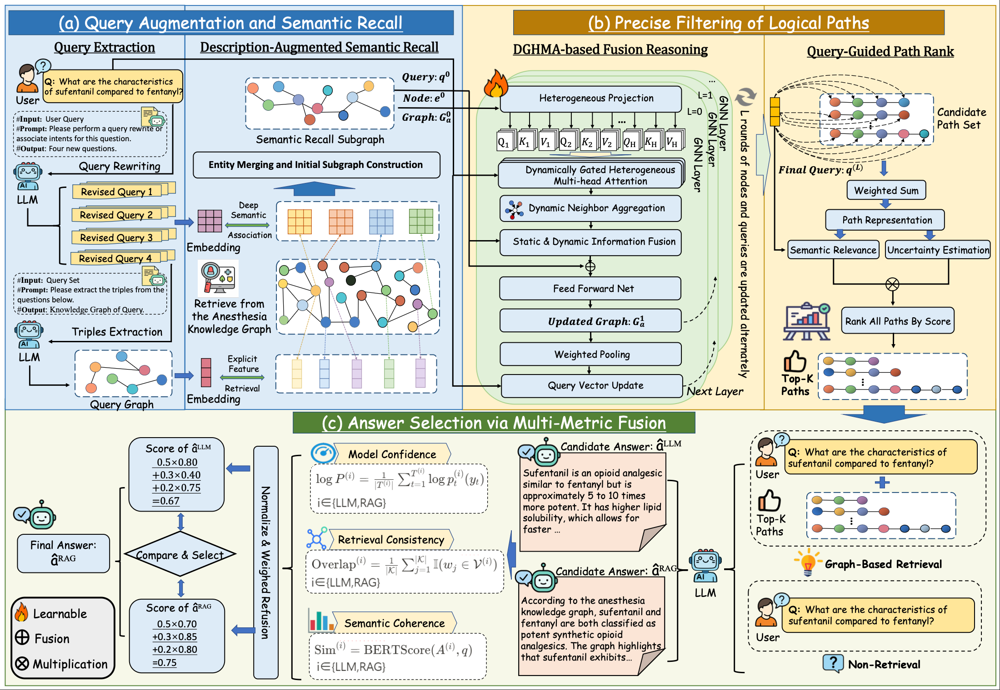

# DUAL-Know

**DUAL-Know: A Description-Augmented and Uncertainty-Aware GraphRAG Framework for Anesthesiology Question Answering**

## Overview

DUAL-Know is a GraphRAG framework designed to provide highly accurate and trustworthy question-answering for the high-stakes domain of clinical anesthesiology. It mitigates LLM hallucinations by integrating dual-channel semantic recall for precise retrieval, a Dynamically Gated Heterogeneous Multi-Head Attention (DGHMA) module for reliable graph reasoning, and a multi-metric fusion strategy for safe answer generation. 

<p align="center">
  
  <br>
  <em>Figure 1. Overview of the proposed Dual-Know Framework.</em>
</p>


## 🔥 Update

**2026.04.01**

* 🚀 Our specialized anesthesiology large language model, **AnesGLM**, has been released on [Hugging Face](https://huggingface.co/QiHongzhi/AnesGLM)!
* 📚 We have updated the `dataset` folder with the multiple-choice and single-choice questions used for model training and evaluation.


## Requirements

### Mandatory

| Dependency | Version |
|------------|---------|
| python | >=3.10 |
| torch | 2.1.0 |
| transformers | 4.41.2 |
| sentence-transformers | 5.2.3 |
| networkx | latest |
| numpy | 1.26.4 |
| faiss-cpu | 1.13.2 |
| jieba | 0.42.1 |
| nltk | 3.9.1 |
| rouge-chinese | 1.0.3 |
| safetensors | 0.4.5 |
| scipy | 1.14.1 |
| scikit-learn | 1.7.2 |

### Optional

| Dependency | Version |
|------------|---------|
| vllm | >=0.4.3 |
| openai | latest |
| bert-score | 0.3.13 |
| accelerate | 0.30.1 |
| peft | 0.11.1 |
| trl | 0.9.6 |
| datasets | 2.19.2 |

> The version numbers listed above are derived from the verified development environment. Other versions may be compatible but have not been tested.

### Installation

```bash
# Clone the repository
git clone https://github.com/<your-username>/dual_know.git
cd dual_know

# Install core dependencies
pip install -r requirements.txt

# (Optional) Install vLLM for inference acceleration
pip install vllm

# (Optional) Install training-related dependencies
pip install accelerate==0.30.1 peft==0.11.1 trl==0.9.6 datasets==2.19.2
```

## Data Preparation

Prepare the following files under `graphrag_export/processed_data_standard/`:

| File | Format | Description |
|------|--------|-------------|
| `entity_table.jsonl` | `{"id": "...", "name": "...", "type": "...", "description": "..."}` | Entity table |
| `kg_triples.jsonl` | `{"head_id": "...", "head": "...", "head_type": "...", "relation": "...", "tail_id": "...", "tail": "...", "tail_type": "..."}` | Knowledge graph triples |
| `kg_graph.pkl` | NetworkX DiGraph | Optional; can be automatically rebuilt from triples |
| `testQAFinal.jsonl` | `{"question": "...", "answer": "..."}` | Test QA dataset |

## Configuration

Edit the key configurations in `configs/config.py`:

```python
# Model paths (must be modified to your own paths)
ANESGLM_MODEL_PATH = "/path/to/your/LLM"
BGE_MODEL_PATH = "/path/to/bge-base-zh-v1.5"

# LLM inference backend
LLM_BACKEND = "transformers"   # "transformers" | "vllm_offline" | "vllm_server"

# Device
DEVICE = "cuda"  # "cuda" | "cpu"
```

## Quick Start

### 1. Environment Verification

```bash
python verify.py
```

Optional checks:
```bash
python verify.py --check_encoder
python verify.py --check_llm
```

### 2. Build Index

FAISS indexes and node embedding caches must be built before the first run (automatically reused thereafter):

```bash
python run.py --mode build_index
```

### 3. Build Node Embedding Cache (Run Once)

Pre-compute and cache all entity node embeddings offline, eliminating the need for real-time encoding during the DGHMA stage at inference time:

```bash
cd dual_know
python utils/embedding_cache.py --build \
    --entity_table  graphrag_export/processed_data_standard/entity_table.jsonl \
    --bge_model     /path/to/bge-base-zh-v1.5 \
    --cache_dir     outputs/node_emb_cache \
    --batch_size    256
```

This takes approximately 1–3 minutes depending on the number of entities, and generates:

```text
outputs/node_emb_cache/
  ├── node_embeddings.npy     # (N, 768) float32 matrix
  ├── node_id_map.pkl         # Entity ID list
  └── cache_meta.json         # Metadata
```

> **Note:** If the cache does not exist when the pipeline is initialized, it will be built automatically. Manual construction is recommended for large-scale knowledge graphs to avoid delays during the first inference run.

### 4. Single Inference

```bash
python run.py --mode single --question "麻醉前评估门诊的主要任务是什么？"
```

The result will be saved to:

```text
outputs/results/single_result.json
```

### 5. Batch Inference

```bash
python run.py --mode batch --dataset_name testQAFinal(or your data name)
python run.py --mode batch --dataset_name testQAFinal --max_samples 100
```

The result file will be saved to:

```text
outputs/results/<dataset_name>_batch_results.jsonl
```

### 6. Evaluation

```bash
python evaluate.py --result_path outputs/results/testQAFinal_batch_results.jsonl
```

This will compute:

- BLEU-4
- ROUGE-1 / ROUGE-2 / ROUGE-L
- GLEU
- Distinct-1 / Distinct-2
- RAG selection ratio

and save the metrics to:

```text
outputs/results/metrics.json
```

## DGHMA Training

```bash
# Data preprocessing + training
python train_dghma.py --phase all --epochs 30

# Preprocessing only
python train_dghma.py --phase preprocess

# Training only
python train_dghma.py --phase train --epochs 30 --lr 1e-4

# Soft-label mode
python train_dghma.py --phase all --label_mode soft --soft_loss mse
```

The best checkpoint is saved to:

```text
outputs/dghma_best.pt
```

## vLLM Acceleration

### Offline Mode (Recommended for Development / Evaluation)

Set in `configs/config.py`:

```python
LLM_BACKEND = "vllm_offline"
```

### Server Mode (Recommended for Production Deployment)

```bash
# Launch the vLLM server
python -m vllm.entrypoints.openai.api_server \
    --model /path/to/AnesGLM \
    --served-model-name AnesGLM \
    --host 0.0.0.0 --port 8000 \
    --dtype float16 \
    --max-model-len 4096 \
    --gpu-memory-utilization 0.90 \
    --trust-remote-code
```

Set in `configs/config.py`:

```python
LLM_BACKEND = "vllm_server"
VLLM_SERVER_URL = "http://localhost:8000"
```


## Alternative Path Ranking Strategies

We provide three alternative path ranking strategies in addition to the default uncertainty-aware ranking:

| Strategy | Command | Description |
|---|---|---|
| Uncertainty-Aware (default) | `--strategy gnn_rank` | DGHMA-based scoring |
| LLM-as-a-Judge | `--strategy llm_rank` | LLM scores paths directly |
| Ours → LLM Cascade | `--strategy gnn_then_llm` | Two-stage: ours first, LLM refines |
| LLM → Ours Cascade | `--strategy llm_then_gnn` | Two-stage: LLM first, ours refines |

### Usage
```bash
# Run with cascade mode (high-precision)
python run_ablation_ranking.py --mode batch --dataset_name testQAFinal --strategy gnn_then_llm

# Run all strategies for comparison
python run_ablation_ranking.py --mode batch --dataset_name testQAFinal
```


## Output Format

Inference results are in JSON format with the following fields:

```json
{
  "question": "Original question",
  "query_set": ["Original question", "Rewrite 1", "Rewrite 2"],
  "query_triples": [{"head": "...", "relation": "...", "tail": "..."}],
  "answer_llm": "Direct LLM answer",
  "answer_rag": "RAG knowledge-enhanced answer",
  "final_answer": "Final fused answer",
  "fusion_detail": {
    "selected": "LLM/RAG",
    "score_llm": 0.0,
    "score_rag": 0.0
  },
  "timing": {"rewrite_and_triple": 0.0, "...": 0.0}
}
```

## License

This project is intended for academic research purposes only.
